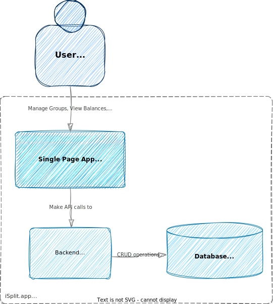

# iSplit.app
Share Expenses. Intuitive, Clean and Free. Ads Free.

## Motivation
The SplitWise app has been a long-standing tool for managing shared expenses, but its recent shift towards a cumbersome UI, an increase in advertisements, and the gating of essential features behind a subscription paywall has lessened its appeal.

Here is an attempt to build yet another application that offers a free, straightforward, and intuitive way to manage shared costs. 

## Goals
- The app shall be easy to use without unnecessary registrations, ads and subscriptions
- The app shall be available on all major platforms to allow participants to manage expenses from different devices
- Educational goal - experimenting with some technologies and approaches for a practical app

## Quality Requirements
**Usability** \
The application shall be so effortless and intuitive that even my lovely 76-year-old mother could gracefully navigate it, to split a dinner bill with her friends.

**Reliability & Resilience** \
The application shall be stable and available 99.9% of time

**Security** \
The application shall be secure enough so that users cannot access group expenses accidentally or maliciously.

## Constraints
The iSplit.app shall be:
- Platform-independent and able to run on the major operating systems and mobile devices
- Developed under a liberal open-source license
  
## Solution Strategy
- The UI part of the solution is a SPA/PWA application implemented in React 19 + TypeScript + HeroUI (formerly NextUI).
  - TypeScript + React is a pretty standard stack. TypeScript provides typing over JavaScript. React is super mature and there are lots of resources for any scenario. Vite is used as the build tool with PWA plugin support.
  - HeroUI is a Tailwind CSS v4-based UI framework that provides modern, accessible components with excellent TypeScript support.  
- The server side is implemented on .NET 9/C# 13 using minimal APIs. The architecture follows clean architecture principles with clear separation of concerns.
  - Uses Linq2DB for data access instead of Entity Framework for better performance and query capabilities.
- PostgreSQL is the chosen database for its reliability and feature set. 
- Runtime hosting is on Kubernetes with Helm charts for deployment configuration.
- Telemetry infrastructure based on Grafana stack + OpenTelemetry (Grafana + Loki + Prometheus + OpenTelemetry Instruments + OpenTelemetry Agent)
- Testing: Vitest with jsdom for frontend testing, XUnit for backend testing

## Building Blocks
The backend part is fully independent from the frontend and can run autonomously. Frontend communicating with the backend through public REST API. 

## Architecture Decisions
**Where to keep Parties/Groups which user visited from device**\
There are two options.
1. Keep them on the user's device. When a user opens a group via link for the first time, the group ID is saved in local storage and becomes available when the user opens the group list.
   - Advantages: simple and clean implementation
   - Disadvantages: harder to transfer all groups to another user/device. If device cache is erased, it's harder to recover and harder to log user activity
2. Introduce a device ID and keep only the device ID on the device. The group/device relationship is tracked on the server and updated every time the user visits a group.
   - Advantages: easier to recover, transfer groups to another user/device and log user activities.
   - Disadvantages: implementation is harder, makes the API heavier and will require additional database writes.
 - **Decision**: For the time being, we will go with option two, which means a client will need to obtain a device ID token via a specific method and then provide it in the header for each request.

**Unique Identifiers**\
Two standard choices - auto-increment and GUID are good enough but have their own drawbacks. Auto-increments are too predictable and require a round-trip when inserting complex objects, and GUIDs do not look good in URLs. Usually, this is considered a bad practice, but since this is an experimental project, let's go with custom monotonically increasing, 11-character-long unique IDs. They don't look too ugly in URLs, are good enough for the database, and have sufficient length to avoid collisions.
- In fact, it is a custom implementation of SnowflakeID, which consists of a 41-bit datetime, 12-bit generator ID, and 10-bit increment. After a new ID is generated, the snowflake int64 ID is converted to a Base62 string (all digits and ASCII characters, [0-9A-Za-z]) for representation. However, in the database it is stored as a bigint.
- To get a unique ID generator, the last 12 bits of the IP address are used. 

**How to store money**\
The most optimal type to store money is BigInt, and the second is int64. int64 should be good enough for the app. https://cardinalby.github.io/blog/post/best-practices/storing-currency-values-data-types/

**REST API Documentation**\
Using minimal APIs with built-in OpenAPI support for documentation

**ORM and DataLayer**\
The standard "go-to" option for .NET - Entity Framework - inherits conceptual flaws that make it overcomplicated and reduce performance and effectiveness. Besides, EF's query capabilities are limited.
Our choice is [Linq2DB](https://github.com/linq2db/linq2db) which is simple, lightweight, and provides additional advantages like rich query capabilities, Merge API, Bulk Insert and others. Although Linq2DB does not provide code-first capabilities, this can be easily supported by [FluentMigrator](https://github.com/fluentmigrator/fluentmigrator).

## Cross-cutting Concerns
- Logging
  - For server application logs, the standard ASP.NET Core logging infrastructure is used, with logs written to standard output.
  - Promtail grabs the logs and puts them into storage (Loki).
- Monitoring, Tracing
  - For Tracing & Monitoring, OpenTelemetry instrumentation is used with export to OpenTelemetry Agent.